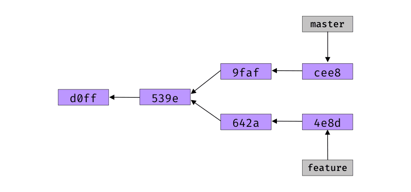

# Topological Sort Git Commits

- If you happen to check the working trees of your git repository, you will find git commits could essentially form a Directed Acyclic Graph (DAG). So, how does tools like "git log" work which could summarize all the commits with corresponding branch information?
- In this project, I looked into the Git Internals. By writing a Python Script, I could successfully create a topological ordering for any trivial Git Repositories (Assume there are no pack files in the git repository) without using any single git command

## What this script could do
- Detect whether the current directory or any parent directory of the current directory is a git repository
- Filter out the Git commits objects and create a topological ordering
- Print out the topological ordering with "sticky start" and "sticky end" [Rules of printing](https://web.cs.ucla.edu/classes/fall20/cs97-1/assign/assign6.html)


## Example

Example 1. Consider the following commits where c3 is a child of c1, and c5 is a child of c4:

  c0 -> c1 -> c2 (branch-1)
         \
          c3 -> c4 (branch-2, branch-5)
                 \
                  c5 (branch-3)
                  
A valid topological ordering from the least to the greatest will be (c5, c4, c3, c2, c1, c0) which should give the following output (assuming the commit hash for cX is hX, and the triple grave accents (```) are not part of the output but merely indicate the start and end of the output lines):

  ```
  h5 branch-3
  h4 branch-2 branch-5
  h3
  h1=

  =
  h2 branch-1
  h1
  h0
  ```
A equally valid topological ordering from the least to the greates will be (c2, c5, c4, c3, c1, c0), which should give the following output:

  ```
  h2 branch-1
  h1=

  =
  h5 branch-3
  h4 branch-2 branch-5
  h3
  h1
  h0
  ```
